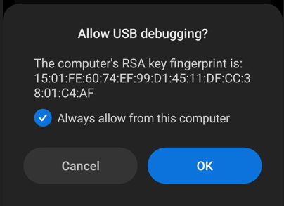

# Resolve Android Device Connectivity

1. First make sure that the *“USB Debugging”* option is turned on for your device. Different devices have different procedures for turning this option on. Search on the web *“How to enable USB Debugging for \<your device model here\>”*
2. If your device has usb debugging enabled, connect the device to the computer and select *“File Transfer”* or similar option.
3. Start Agent and Appium servers from Agent Desktop
4. From Agent Desktop’s menu bar, select File>Reload ADB
5. After the success message on logs, press on “Detect Devices”.
6. On the logs section of the agent desktop, the list of devices should show “device” next to your device id. Following is an example.

```
List of devices attached
7cc32e6a device
```
   
7. If it shows *“device”* next to the device id then you don’t have to follow any more steps from here.
8. Else if it shows *“unauthorized”* instead of “device”, there should be a prompt asking you to allow the device for usb debugging on your device.
9. Enable the option *“Always allow”* and then press Allow or Ok from the device.
    
10. If you do not see such a prompt and your device is shown as *“unauthorized”*, revoke usb debugging authorizations from developer settings of your phone, restart/reboot the phone and try from step 1 again.


